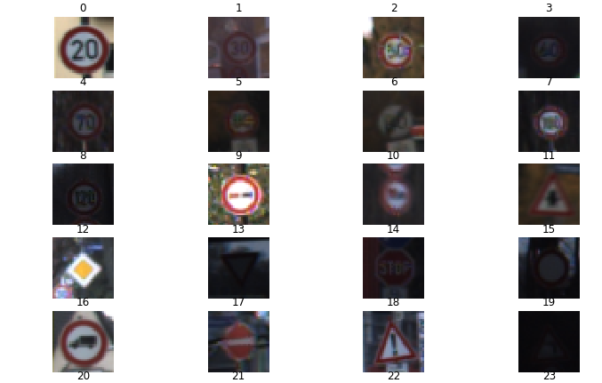
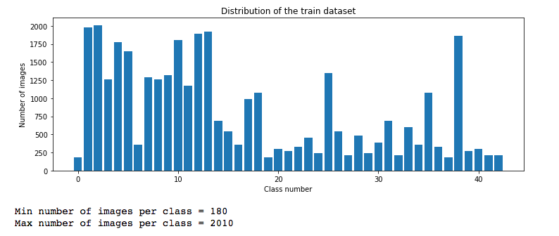
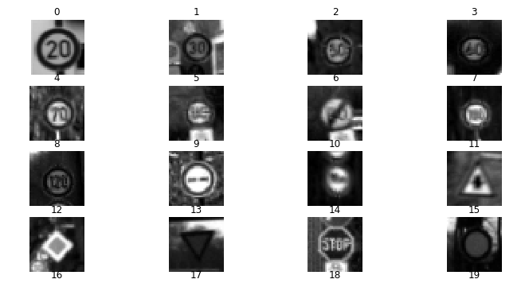
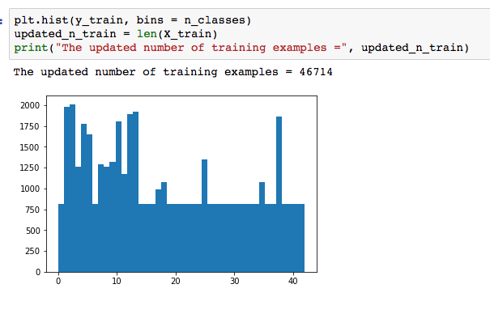
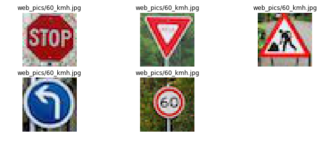
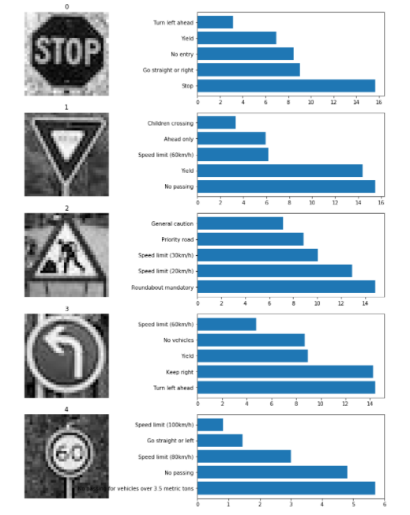

#**Traffic Sign Recognition** 

## Writeup Template

### You can use this file as a template for your writeup if you want to submit it as a markdown file, but feel free to use some other method and submit a pdf if you prefer.

---

**Build a Traffic Sign Recognition Project**

The goals / steps of this project are the following:
* Load the data set (see below for links to the project data set)
* Explore, summarize and visualize the data set
* Design, train and test a model architecture
* Use the model to make predictions on new images
* Analyze the softmax probabilities of the new images
* Summarize the results with a written report


## Rubric Points
### Here I will consider the [rubric points](https://review.udacity.com/#!/rubrics/481/view) individually and describe how I addressed each point in my implementation.  

---
### Writeup / README


#### 1. Provide a Writeup / README that includes all the rubric points and how you addressed each one. You can submit your writeup as markdown or pdf. You can use this template as a guide for writing the report. The submission includes the project code.

You're reading it! and here is a link to my [project code](https://github.com/Vasuji/carnd-project2)

### Data Set Summary & Exploration

#### 1. Provide a basic summary of the data set and identify where in your code the summary was done. In the code, the analysis should be done using python, numpy and/or pandas methods rather than hardcoding results manually.

The code for this step is contained in the first and second code cell of the IPython notebook.  

I used the pandas library to calculate summary statistics of the traffic
signs data set:

* The size of training set is 34799.
* The size of test set is 12630.
* The shape of a traffic sign image is (32, 32, 3).
* The number of unique classes/labels in the data set is 43.

#### 2. Include an exploratory visualization of the dataset and identify where the code is in your code file.

The code for this step is contained in the third and fourth code cell of the IPython notebook.  

Here is an exploratory visualization of the data set. It is a subplot displaying few images from data and histogram showing no of sample in each classes before preprocessing.





### Design and Test a Model Architecture

#### 1. Describe how, and identify where in your code, you preprocessed the image data. What tecniques were chosen and why did you choose these techniques? Consider including images showing the output of each preprocessing technique. Pre-processing refers to techniques such as converting to grayscale, normalization, etc.

The code for this step is contained in the 5th and 6th code cell of the IPython notebook.

As a first step, I decided to convert the images to grayscale because there is not significant information loss on going from GBG to grey. Rather this will speed up the training process by reducing the size of the data.

Here is an example of a traffic sign image after grayscaling which is done at 7th code cell.



As a last step, I normalized the image data because it is easy to processes data from input layer once these data are normalized.


--------------


#### 2. Describe how, and identify where in your code, you set up training, validation and testing data. How much data was in each set? Explain what techniques were used to split the data into these sets. (OPTIONAL: As described in the "Stand Out Suggestions" part of the rubric, if you generated additional data for training, describe why you decided to generate additional data, how you generated the data, identify where in your code, and provide example images of the additional data)

The code for splitting the data into training and validation sets is contained in the 13th code cell of the IPython notebook.  

To cross validate my model, I randomly split the training data into a training set and validation set. I did this by first shuffling the training data set and splitting them by using sklearn ```train_test_split``` function in ```model selection```.

```

        from sklearn.model_selection import train_test_split
        
        # shuffleing data
        X_train, y_train = shuffle(X_train, y_train)
        
        # For each epoch, there are separate training data and validation data
        X_train_epoch, X_valid_epoch, y_train_epoch, y_valid_epoch\
                                    = train_test_split(X_train, y_train,\
                                                     stratify = y_train,\
                                                     test_size=0.1,\
                                                     random_state=23)
```

My final training set had 42042 number of images. My validation set and test set had 4672 and 12630 number of images.

The 8th and 9th code cell of the IPython notebook contains the code for augmenting the data set. I decided to generate additional data because all class of traffic sign do not have sufficient data to train the model. To add more data to the the data set, I used the following techniques: 

1. I calculated mean no of sample by performing bean count of each classes

```
pics_per_class = np.bincount(y)
mean_pics = int(np.mean(pics_per_class))
```
2. I generated extra picture of that class randomly if number of pictures is less the then mean number of sample. I determined how much extra picture are required by substracting number of present picture from mean number. This is done in 8th and 9th code cell.

```
if pics_per_class[i] < mean_pics:
      # Count how many additional pictures we want
      new_wanted = mean_pics - pics_per_class[i]
```

3. Finally generated extra pictures were appended. The extra data generated was  equal to 11915.


Here is a histogram representing distribution of all  training data (old+extra) in different classes taken from 10th code cell:



The difference between the original data set and the augmented data set is the following:
1. Initially all data was not uniformly distributed in each classes.
2. Initial data was not preprocessed now we have preprocessed data.


----------------


#### 3. Describe, and identify where in your code, what your final model architecture looks like including model type, layers, layer sizes, connectivity, etc.) Consider including a diagram and/or table describing the final model.

The code for my final model is located in the 14th cell of the ipython notebook. 

My final model consisted of the following layers:

| Layer         	|     Description	        	| 
|:---------------------:|:---------------------------------------------:| 
| Input         	| 32x32x1 gray image   			| 
| Convolution 5x5     	| 1x1 stride, VALID padding, outputs 28x28x6 	|
| RELU			| 	|
| Max pooling	      	| 2x2 stride, Output = 14x14x6			|
| Convolution 3x3	| 5x5 stride, VALID padding, outputs 10x10x16 
| RELU			| 	||
| Max pooling	      	| 2x2 stride, Output = 5x5x16		|
| Fully connected	| Input = 400, Output = 120      |
| Fully connected	|  Input = 120. Output = 84    		  |
| Fully connected	|  Input = 84. Output = 43   		  |


------------------


#### 4. Describe how, and identify where in your code, you trained your model. The discussion can include the type of optimizer, the batch size, number of epochs and any hyperparameters such as learning rate.

The code for training the model is located in the 18th cell of the ipython notebook. 

To train the model, I used the following:

1. Type of optimizer: AdamOptimizer

I utilized the AdamOptimizer from within TensorFLow to optimize because it seemed to do better than a regular Gradient Descent Optimizer. It is in 17th cell of the ipython notebook.

```
logits = LeNet(x)
cross_entropy = tf.nn.softmax_cross_entropy_with_logits(logits, one_hot_y)
loss_operation = tf.reduce_mean(cross_entropy)
optimizer = tf.train.AdamOptimizer(learning_rate = rate)
training_operation = optimizer.minimize(loss_operation)
```

2. the batch size: 160

I tried a few different batch sizes and finally found 160 to perform better than batch sizes larger or smaller than that.

3. number of epochs :  20

I ran only 20 epochs. The time and performance gains are two major factors to be considered during training. For performance gains, it was already arriving at nearly 97-98% validation accuracy. Adding further epochs resulted in only marginal gains but this increased time incurred in training. There is potential risk of overfitting the data on further improvement in validation accuracy.
 
4. hyperparameters : learning rate = 0.001, mean = 0.0 sigma = 0.1

For the model hyperparameters, I took learning rate of 0.001, mean of 0 and standard deviation/sigma of 0.1 so that I could avoid the local maxima during optimization and other noise. On doing this, the model is directed to keep a mean of 0 and equal variance, so these hyperparameters attempt to follow this line. Other value of mean and standard deviation took me away from performance gains perspective and computation time.


-----------------


### 5. Describe the approach taken for finding a solution. Include in the discussion the results on the training, validation and test sets and where in the code these were calculated. Your approach may have been an iterative process, in which case, outline the steps you took to get to the final solution and why you chose those steps. Perhaps your solution involved an already well known implementation or architecture. In this case, discuss why you think the architecture is suitable for the current problem.

The code for calculating the accuracy of the model is located in the ninth cell of the Ipython notebook.

My final model results were:
* training set accuracy of 98 %
* validation set accuracy of 98%
* test set accuracy of 90%

If a well known architecture was chosen:

* What architecture was chosen?

I used convolutional neural network, as these tend to do very well with images. I started with LeNet neural network and tried to play around this architecture. I used 2 convolutional layers and 3 fully connected layers. There is speed accuracy trade off. I also did a few attempts with one less convolutional layer which sped it up by a decent amount but dropped the accuracy. Further one less fully connected layer only marginally dropped the accuracy.


* Why did you believe it would be relevant to the traffic sign application?

Starting with LeNet structure I added one extra dropout layer to the fully connected layers. Although this makes initial epochs in validation a little worse, I gained an additional 3% on test accuracy. Since I was getting to validation accuracy of around 97%, with test accuracy down by 88-89%, there was clearly a little bit of overfitting being done. Dropout helped get my test accuracy into the 90's by preventing some of that overfitting. I put dropout at 0.7 probability as that tended to still validate at a decent rate within an acceptable number of epochs over a lower number such as 0.5. Also, I switched max pool to average pool as that seemed to slightly increase accuracy.

* How does the final model's accuracy on the training, validation and test set provide evidence that the model is working well?
 
I ran through a few items for each paramater in order to tune my model further. The results of this are shown below; not that this is not a true grid search as I was only tuning one parameter at a time as opposed to checking every combination of the below items. For speed's sake, I stuck to 10 epochs, although there is definitely a potential had I ran through something like 100 epochs to improve the validation accuracy while at the same time arriving at a better final test score. The default otherwise used was a learning rate of .01, 150 batch size, 2 convolutional layers and 3 fully connected layers (which is after a little bit of guess and check already).

Learning rate after 10 epochs:
.1 = .040
.01 = .976 .005 = .983 .001 = .973
Batch size after 10 epochs:
250 = .967
150 = .976
50 = .043

Less layers after 10 epochs:
2 convolutional, 3 fully connected = .976
1 convolutional, 3 fully connected = .944
2 convolutional, 2 fully connected = .979

(this came out slightly better than the 2 convolutional and 3 fully connected above, but given the similarity I preferred the slightly deeper model as there was almost no difference in speed. I chose this because I thought the additional layer that included dropout would help against overfitting).

As the CNN with 2 convolutional layers, 3 fully connected, a learning rate of .001 and a batch size 160 appears to result in the optimal CNN, I utilized this for the final model.


### Test a Model on New Images

#### 1. Choose five German traffic signs found on the web and provide them in the report. For each image, discuss what quality or qualities might be difficult to classify.

Here are five German traffic signs that I found on the web:

 

The first image(stop) might not be difficult to classify because it looks lees confusing in comparesion to thers. The third image(road work) is little bit confusing with second (Yield) because the color intensity distibution is pretty much similar. The 4 th image (Left turn) should be easy but 5th image(60 KM) is kind of confusing because other traffic symbols also have such symbol like 30 KM.


-----------

#### 2. Discuss the model's predictions on these new traffic signs and compare the results to predicting on the test set. Identify where in your code predictions were made. At a minimum, discuss what the predictions were, the accuracy on these new predictions, and compare the accuracy to the accuracy on the test set (OPTIONAL: Discuss the results in more detail as described in the "Stand Out Suggestions" part of the rubric).

The code for making predictions on my final model is located in the tenth cell of the Ipython notebook.

Here are the results of the prediction:

| Image			        |     Prediction	        					| 
|:---------------------:|:---------------------------------------------:| 
| Stop Sign      		| Stop sign   									| 
| Yield				| Yield											|
| Road Work			| Speed Limit 30 KM 							|
| Turn left     		| Turn left 										|
| 60 km/h	      		| Yield					 				|


The model was able to correctly guess 3 of the 5 traffic signs, which gives an accuracy of 60%. This compares favorably to the accuracy on the test set.


-------------

#### 3. Describe how certain the model is when predicting on each of the five new images by looking at the softmax probabilities for each prediction and identify where in your code softmax probabilities were outputted. Provide the top 5 softmax probabilities for each image along with the sign type of each probability. (OPTIONAL: as described in the "Stand Out Suggestions" part of the rubric, visualizations can also be provided such as bar charts)

The code for making predictions on my final model is located in the 11th cell of the Ipython notebook. The result image is shown below.




1. For the first image, Stop sign, as I expected, it got the fact that it was a speed sign correct, but unfortunately thought it was the 80 km/h sign. Given the highest probability was only around 3%, the model definitely struggles distinguishing between speed signs (the top four probabilities are all speed signs).

2. For the second (left turn), it unfortunately guessed it as a "No Vehicles" sign first; however, the second highest probability is the correct answer of the Left Turn Ahead. I'm fairly intrigued by the model putting the No Vehicles sign here, as it actually lands in the top five for four of the five signs I looked at. It must mainly be focused on the sign being round for that one.

3. For the third, it incorrectly guesses priority road. I believe this is due to the sign shape. Somewhat oddly, it never guesses the road work sign at all. This may be due to the limited number of epochs (10) I ran on the model - the complexity of the inner shape may be difficult for the model to learn in such a short time (if at all).

4. It correctly guesses both the fourth and fifth images! It is much more confident on the yield sign than anything it thought on the others.


So, my model only worked exactly on 40% of the additional pictures. However, it also correctly identified the 60 km/h sign as a speed sign, and was fairly close on the Left Turn Ahead sign, so with some tweaking of either the model or further preprocessing of the images, I bet I could get to at least 80% on these. This is of course still lower than the nearly 93% achieved on the test data, but still would be fairly good for not having curated the images exactly like whomever did so on the original dataset.


